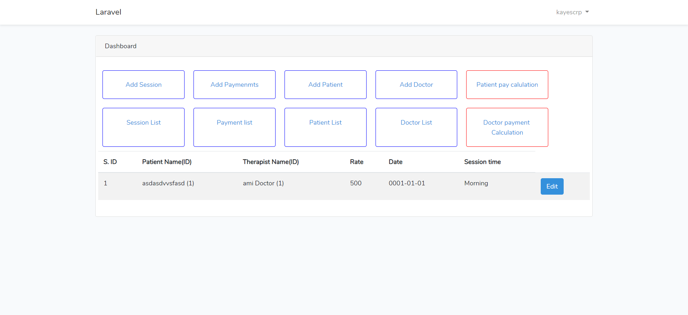

## About
This is made for a Physio Therapy center in bangladesh. User can add, edit doctor information and patient information. From Add session menu admin can entry how many time a patient took service from this hospital and keep track of it. Add payment menu is used for payment entry. In the end program will show total bill of a patient and how much patient paid, did the patient has any advanced payment or due. and doctor income is automatically calculated from which patient doctor worked for which patient and how many time.

## Screen Shots

 Add Payment Menu

 Payment list Menu

 Add Doctor Menu

 Doctor list Menu

 Add Patient Menu

 patient list Menu
    

 Doctor Payment Calculation Menu

 Session list Menu

 Patient Payment Calculation Menu

 patient Cost details Menu

## How to Connect Database
Link database in .env file then run this code in cmd,
> php artisan migrate

## Feel Free to use this program
